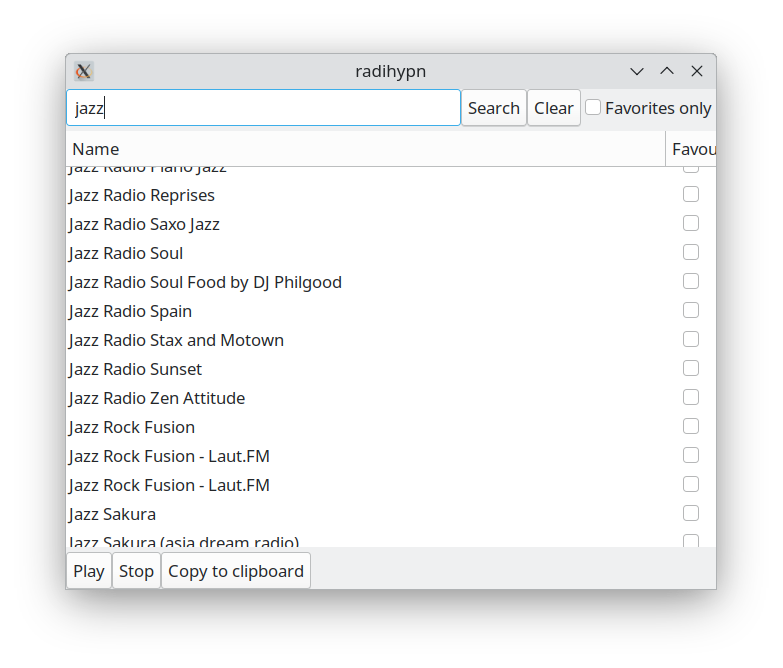

# radihypn Internet Radio
Small and simple gtk3 internet radio that has nice tray icon in gtk3 environments like mate, xfce4. Tray icon does not work on Wayland.



## Install for Ubuntu 20.04

### install deps:

```bash
sudo add-apt-repository -y ppa:xmake-io/xmake
sudo apt update
sudo apt install -y build-essential libsqlite3-dev libgstreamer1.0-dev libcurlpp-dev libgtk-3-dev libcurl4-openssl-dev pkg-config libgtkmm-3.0-dev meson cmake xmake git unzip valac gobject-introspection python3-pip wget curl libgirepository1.0-dev python3-gi python3-gi-cairo ninja-build python-gi-dev
```

### clone repo:
```bash
git clone --depth=1 --recursive "https://github.com/radihypn/radihypn"
cd radihypn
```

### build and install locally without root:
```bash
xmake config -y --mode=release && xmake build -y radihypn && DESTDIR=~/.local xmake install -y
```

### support
You can support this project sending donations to:

- monero: 87HRwEMUPwVKU6h79WYm2bVtEasGXUBnmQSKgkfCfgdZCjHUGPEd91AAzYz6SDoH9vDvqPm1zxyNyRWw1pFkUvZSQNpJt18
